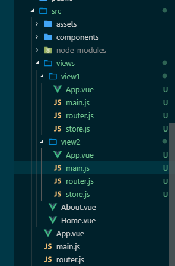

# vue.config.js 的配置 vue-cli 3.3.0

## 基础配置

### **publicPath**

> Type: string
>
> Default: '/'

部署应用包时的基本 URL,默认情况下应用是部署在一个域名的根路径 '/',如果部署在一个二级目录则设置为二级路径名 '/my-app/'.

开发环境可以用来区分开发和正式环境.

* 备注

    > 改变静态文件的引用路径；默认的路径都是基于服务器根目录的绝对路径；当目录为二级目录时，无法找到对应静态文件，需更改引用路径
    >
    > 例：
    >
    > 静态资源路径 ```http://test2.test/js/about.9688aefc.js```
    >
    > 设置 publicPath '/test2/'(绝对路径) =>  ```http://test2.test/test2/js/about.9688aefc.js```
    >
    > 设置 publicPath './test2'(相对路径) => ```http://test2.test/index.html放置的文件路径（相对域名根目录）/test2/js/about.9688aefc.js```

```js
module.exports = {
    publicPath: process.env.NODE_ENV === 'production' ? '/production-sub-path/' : '/'
}
```

---

### **outputDir**

> Type: string
>
> Default: 'dist'

当运行 `vue-cli-service build` 时生成的生产缓解构建文件的目录.

* 备注
    > 更改打包后放置的文件夹名

---

### **assetsDir**

> Type: string
>
> Default: ''

放置生成的静态资源(js、css、img、fonts)的,目录相对于 outputDir 的.

* 备注
    > 使用相对地址，不能用绝对地址。默认为空，即静态资源分开放置于 outputDir 目录中。

---

### **filenameHashing**

> Type: boolean
>
> Default: true

静态文件名中包含了 hash 以便更好的控制缓存.

* 备注
    > 例：
    >
    > ```http://test2.test/js/about.9688aefc.js``` 9688aefc 即为哈希值。
---

### **pages**

> Type: Object
>
> Default: undefined

在 multi-page 模式下构建应用。每个“page”应该有一个对应的 JavaScript 入口文件。其值应该是一个对象，对象的 key 是入口的名字，value 是配置值，除了 entry 之外都是可选的。

```js
module.exports = {
  pages: {
    index: {
      // page 的入口
      entry: 'src/index/main.js',
      // 模板来源
      template: 'public/index.html',
      // 在 dist/index.html 的输出
      filename: 'index.html',
      // 当使用 title 选项时，
      // template 中的 title 标签需要是 <title><%= htmlWebpackPlugin.options.title %></title>
      title: 'Index Page',
      // 在这个页面中包含的块，默认情况下会包含
      // 提取出来的通用 chunk 和 vendor chunk。
      chunks: ['chunk-vendors', 'chunk-common', 'index']
    },
    index2: {
      // page 的入口
      entry: 'src/index/main2.js',
      // 模板来源
      template: 'public/index2.html',
      // 在 dist/index.html 的输出
      filename: 'index2.html',
      // 当使用 title 选项时，
      // template 中的 title 标签需要是 <title><%= htmlWebpackPlugin.options.title %></title>
      title: 'Index Page',
      // 在这个页面中包含的块，默认情况下会包含
      // 提取出来的通用 chunk 和 vendor chunk。
      chunks: ['chunk-vendors', 'chunk-common', 'index']
    },

    // 当使用只有入口的字符串格式时，
    // 模板会被推导为 `public/subpage.html`
    // 并且如果找不到的话，就回退到 `public/index.html`。
    // 输出文件名会被推导为 `subpage.html`。
    subpage: 'src/subpage/main.js'
  }
}
```

* 备注
    > 简易使用方式如上设置多页面的入口，与打包输出出的入口文件名。
    >
    > 文件夹的设置 

---

### **lintOnSave**

> Type: boolean | 'error'
>
>Default: true

是否在开发环境保持时 lint 代码，需安装 @vue/cli-plugin-eslintvue/cli-plugin-eslint

* ture: 命令行输出编译警告，编译不会因此失败
* 'error': 命令行输出编译错误，编译将失败

```js
// 设置让浏览器 overlay 同时显示警告和错误
module.exports = {
  devServer: {
    overlay: {
      warnings: true,
      errors: true
    }
  }
}
// 控制 eslint-loader 在开发和生产构建下启用
module.exports = {
  lintOnSave: process.env.NODE_ENV !== 'production'
}
```

* 备注
    > 静态代码检查，每次代码保存时候自动检测，线上环境可取消。

---

### **runtimeCompiler**

> Type: boolean
>
> Default: false

是否使用包含运行时编译器的 Vue 构建版本。

更多细节可以查阅：[Runtime + Compiler vs. Runtime only](https://cn.vuejs.org/v2/guide/installation.html#%E8%BF%90%E8%A1%8C%E6%97%B6-%E7%BC%96%E8%AF%91%E5%99%A8-vs-%E5%8F%AA%E5%8C%85%E5%90%AB%E8%BF%90%E8%A1%8C%E6%97%B6)

* 备注
    > 在文件中使用 template 选项，需要使用编译器。打包时会调用 vue-loader 预编译,最终打包好的包不需要编译器。如果没有预编译并使用了 template 需要使用带编译器版本。

```js
    // 需要编译器
new Vue({
  template: '<div>{{ hi }}</div>'
})

// 不需要编译器
new Vue({
  render (h) {
    return h('div', this.hi)
  }
})
```

---

### **transpileDependencies**

> Type: ```Array<string | RegExp>```
>
> Default: [ ]

默认情况下 babel-loader 会忽略所有 node_modules 中的文件。如果你想要通过 Babel 显式转译一个依赖，可以在这个选项中列出来。

* 备注
    > 加入的的依赖包会进行 Babel 转义，适用于解决依赖包兼容性问题。

---

### **productionSourceMap**

> Type: boolean
>
> Default: true

是否开启 soruce map 在生产环境。开启后可以快速定位错误。

开启 source map 后，我们打包输出的文件中会包含 js 对应的 .map 文件。更多细节可以查阅[JavaScript Source Map 详解](http://www.ruanyifeng.com/blog/2013/01/javascript_source_map.html)。

* 备注
    > 源码经过编译后代码代码阅读性降低；使用 source map可以定位错误地点。Source map就是一个信息文件，里面储存着位置信息，放置源码附近。source map 还需要浏览器支持。关闭可加快开发环境编译速度。

---

### **crossorigin**

> Type: string
>
> Default: undefined

设置生成的 HTML 中 ```<link rel="stylesheet">```和 ```<script></script>``` 标签的 crossorigin 属性。

需要注意的是该选项仅影响由 html-webpack-plugin 在构建时注入的标签 - 直接写在模版 (public/index.html) 中的标签不受影响。

更多细节可查阅：[CORS settings attributes](https://developer.mozilla.org/zh-CN/docs/Web/HTML/CORS_settings_attributes)

* 备注
    > 设置跨域属性，anonymous 对此元素的 CORS 请求将不设置凭据标志；use-credentials 对此元素的 CORS 请求将设置凭证标志

---

### **integrity**

> Type: boolean
>
> Default: false

在生成的 HTML 中设置子资源完整性（SRI）。提高文件的安全性防止被篡改。

仅影响 html-webpack-plugin 构建的时候注入的标签。

* 备注
    > 子资源完整性（SRI）是允许浏览器检查其获得的资源是否被篡改的一项安全特性。它通过验证获取文件的哈希值是否和你提供的哈希值一样来判断资源是否被篡改。

---

### **configureWebpack**

>Type: Object | Function

如果这个值是一个对象，则会通过 webpack-merge 合并到最终的配置中。

如果这个值是一个函数，则会接收被解析的配置作为参数。该函数及可以修改配置并不返回任何东西，也可以返回一个被克隆或合并过的配置版本。

更多细节可查阅：[配合 webpack > 简单的配置方式](https://cli.vuejs.org/zh/guide/webpack.html#%E7%AE%80%E5%8D%95%E7%9A%84%E9%85%8D%E7%BD%AE%E6%96%B9%E5%BC%8F)

* 备注
    > 有些 webpack 选项是基于 vue.config.js 中的值设置的，所以不能直接修改。例如你应该修改 vue.config.js 中的 outputDir 选项而不是修改 output.path；你应该修改 vue.config.js 中的 publicPath 选项而不是修改 output.publicPath。这样做是因为 vue.config.js 中的值会被用在配置里的多个地方，以确保所有的部分都能正常工作在一起。

```js
// vue.config.js
module.exports = {
  configureWebpack: config => {
    if (process.env.NODE_ENV === 'production') {
      // 为生产环境修改配置...
    } else {
      // 为开发环境修改配置...
    }
  }
}
```

---

### **chainWebpack**

>Type: Function

是一个函数，会接收一个基于 [webpack-chain](https://github.com/mozilla-neutrino/webpack-chain) 的 ChainableConfig 实例。允许对内部的 webpack 配置进行更细粒度的修改。

更多细节可查阅：[配合 webpack > 链式操作](https://cli.vuejs.org/zh/guide/webpack.html#%E9%93%BE%E5%BC%8F%E6%93%8D%E4%BD%9C-%E9%AB%98%E7%BA%A7)

* 备注

```js
// vue.config.js 修改 Loader 选项
module.exports = {
  chainWebpack: config => {
    config.module
      .rule('vue')
      .use('vue-loader')
        .loader('vue-loader')
        .tap(options => {
          // 修改它的选项...
          return options
        })
  }
}

// vue.config.js  添加一个新的 Loader
module.exports = {
  chainWebpack: config => {
    // GraphQL Loader
    config.module
      .rule('graphql')
      .test(/\.graphql$/)
      .use('graphql-tag/loader')
        .loader('graphql-tag/loader')
        .end()
  }
}

// vue.config.js 替换一个规则里的 Loader
module.exports = {
  chainWebpack: config => {
    const svgRule = config.module.rule('svg')

    // 清除已有的所有 loader。
    // 如果你不这样做，接下来的 loader 会附加在该规则现有的 loader 之后。
    svgRule.uses.clear()

    // 添加要替换的 loader
    svgRule
      .use('vue-svg-loader')
        .loader('vue-svg-loader')
  }
}

// vue.config.js  修改插件选项
module.exports = {
  chainWebpack: config => {
    config
      .plugin('html')
      .tap(args => {
        return [/* 传递给 html-webpack-plugin's 构造函数的新参数 */]
      })
  }
}
```

---

### **css.modules**

> Type: boolean
>
> Default: false

默认情况下，只有 *.module.[ext] 结尾的文件才会被视作 CSS Modules 模块。设置为 true 后你就可以去掉文件名中的 .module 并将所有的 *.(css|scss|sass|less|styl(us)?) 文件视为 CSS Modules 模块。

更多细节可查阅：[配合 CSS > CSS Modules](https://cli.vuejs.org/zh/guide/css.html#css-modules)

* 备注
    > CSS Modules 是一个用于模块化合组合 CSS 的系统。vue-loader 提供了与 CSS Modules 的一流集成，可以作为模拟 scoped CSS 的替代方案。

```js
// webpack.config.js 向 css-loader 传入 modules:true 来开启：
{
  module: {
    rules: [
      // ... 其它规则省略
      {
        test: /\.css$/,
        use: [
          'vue-style-loader',
          {
            loader: 'css-loader',
            options: {
              // 开启 CSS Modules
              modules: true,
              // 自定义生成的类名
              localIdentName: '[local]_[hash:base64:8]'
            }
          }
        ]
      }
    ]
  }
}

```

```html
// 在 <style> 上添加 module 特性：
<style module>
.red {
  color: red;
}
.bold {
  font-weight: bold;
}
</style>

// 这个 module 特性指引 Vue Loader 作为名为 $style 的计算属性，向组件注入 CSS Modules 局部对象。然后你就可以在模板中通过一个动态类绑定来使用它了：

<template>
  <p :class="$style.red">
    This should be red
  </p>
</template>
```

---

### **css.extract**

> Type: boolean | Object
>
> Default: 生产环境下是 true,开发环境下是 false

是否将组件中的 CSS 提取至一个独立的 CSS 文件中 (而不是动态注入到 JavaScript 中的 inline 代码)。

同样当构建 Web Components 组件时它总是会被禁用 (样式是 inline 的并注入到了 shadowRoot 中)。

当作为一个库构建时，你也可以将其设置为 false 免得用户自己导入 CSS。

提取 CSS 在开发环境模式下是默认不开启的，因为它和 CSS 热重载不兼容。然而，你仍然可以将这个值显性地设置为 true 在所有情况下都强制提取。

* 备注
    > 如果你的样式文件大小较大，这会做更快提前加载，因为 CSS bundle 会跟 JS bundle 并行加载；css 单独缓存；css 请求并行；更快的浏览器运行时（runtime）（更少代码和 DOM 操作）；CSS SourceMap

---

### **css.sourceMap**

> Type: boolean
>
> Default: false

是否为 CSS 开启 source map。设置为 true 之后可能会影响构建的性能。

* 备注
    > 方便定位错误

---

### **css.loaderOptions**

> Type: Object
>
> Default: {}

向 CSS 相关的 loader 传递选项。例如：

```js
module.exports = {
  css: {
    loaderOptions: {
      css: {
        // 这里的选项会传递给 css-loader
      },
      postcss: {
        // 这里的选项会传递给 postcss-loader
      }
    }
  }
}
```

支持的 loader:

* [css-loader](https://github.com/webpack-contrib/css-loader)
* [postcss-loader](https://github.com/postcss/postcss-loader)
* [sass-loader](https://github.com/webpack-contrib/sass-loader)
* [less-loader](https://github.com/webpack-contrib/less-loader)
* [stylus-loader](https://github.com/shama/stylus-loader)

>提示
>
>相比于使用 chainWebpack 手动指定 loader 更推荐上面这样做，因为这些选项需要应用在使用了相应 loader 的多个地方。

---

### **devServer**

> Type: Object

参考 [webpack-dev-server](https://webpack.js.org/configuration/dev-server/)

* 备注
    > 提供一个简单的 web server,并且具有 live reloading 功能。

```js
// vue.config.js
module.exports = {
  devServer: {
      open: true, // 是否自动打开浏览器页面
      host: '0.0.0.0', // 指定使用一个 host。默认是 localhost
      port: 8080, // 端口地址
      https: false, // 使用https提供服务
      proxy: null, // string | Object 代理设置
        // 提供在服务器内部的其他中间件之前执行自定义中间件的能力
      before: app => {
          // `app` 是一个 express 实例
      }
  }

}
```

---

### **devServer.proxy**

> Type: string | Object

如果你的前端应用和后端 API 服务器没有运行在同一个主机上，你需要在开发环境下将 API 请求代理到 API 服务器。这个问题可以通过 vue.config.js 中的 devServer.proxy 选项来配置。

参考 [http-proxy-middleware](https://github.com/chimurai/http-proxy-middleware#proxycontext-config)

* 备注
    > 在于单独的后端开发服务器 API,并且希望在同域名下发送 API 请求，可以使用开发服务器代理 API URL。

---

### **parallel**

> Type: boolean
>
> Default: require('os').cpus().length > 1

是否为 Babel 或 TypeScript 使用 thread-loader。该选项在系统的 CPU 有多于一个内核时自动启用，仅作用于生产构建。

* 备注
    > 将 loader 放置在 worker 池中运行。

---

### **pwa**

> Type: Object

向 [PWA 插件](https://github.com/vuejs/vue-cli/tree/dev/packages/%40vue/cli-plugin-pwa)传递参数。

* 备注
    > PWA(Progressive Web Apps) 网页应用；可以尽力接近原生应用；下一代 WEB 模型。

---

### **pluginOptions**

> Type: Object

这是一个不进行任何 schema 验证的对象，因此它可以用来传递任何第三方插件选项。

* 备注

```js
// 第三方插件可以读取 projectOptions.pluginOptions.foo 来做条件式的决定配置。
module.exports = {
  pluginOptions: {
    foo: { /* ... */ }
  }
}

```

```js
// vue-loader是 webpack 的加载器，允许你以单文件组件的格式编写 Vue 组件
const VueLoaderPlugin = require('vue-loader/lib/plugin');

// webpack 内置插件，用于创建在编译时可以配置的全局常量
const { DefinePlugin } = require('webpack');

// 用于强制所有模块的完整路径必需与磁盘上实际路径的确切大小写相匹配
const CaseSensitivePathsPlugin = require('case-sensitive-paths-webpack-plugin');

// 识别某些类型的 webpack 错误并整理，以提供开发人员更好的体验。
const FriendlyErrorsPlugin = require('friendly-errors-webpack-plugin');

// 将 CSS 提取到单独的文件中，为每个包含 CSS 的 JS 文件创建一个 CSS 文件
const MiniCssExtractPlugin = require("mini-css-extract-plugin");

// 用于在 webpack 构建期间优化、最小化 CSS文件
const OptimizeCssnanoPlugin = require('optimize-css-assets-webpack-plugin');

// webpack 内置插件，用于根据模块的相对路径生成 hash 作为模块 id, 一般用于生产环境
const { HashedModuleIdsPlugin } = require('webpack');

// 用于根据模板或使用加载器生成 HTML 文件
const HtmlWebpackPlugin = require('html-webpack-plugin');

// 用于在使用 html-webpack-plugin 生成的 html 中添加 <link rel ='preload'> 或 <link rel ='prefetch'>，有助于异步加载
const PreloadPlugin = require('preload-webpack-plugin');

// 用于将单个文件或整个目录复制到构建目录
const CopyWebpackPlugin = require('copy-webpack-plugin');

module.exports = {
    plugins: [
        /* config.plugin('vue-loader') */
        new VueLoaderPlugin(),
        /* config.plugin('define') */
        new DefinePlugin(),
        /* config.plugin('case-sensitive-paths') */
        new CaseSensitivePathsPlugin(),
        /* config.plugin('friendly-errors') */
        new FriendlyErrorsWebpackPlugin(),
        /* config.plugin('extract-css') */
        new MiniCssExtractPlugin(),
        /* config.plugin('optimize-css') */
        new OptimizeCssnanoPlugin(),
        /* config.plugin('hash-module-ids') */
        new HashedModuleIdsPlugin(),
        /* config.plugin('html') */
        new HtmlWebpackPlugin(),
        /* config.plugin('preload') */
        new PreloadPlugin(),
        /* config.plugin('copy') */
        new CopyWebpackPlugin()
    ]
}
```

## 结合环境配置

一般情况下环境的划分：

* 开发环境（本地开发版本，会有些调试工具与辅助插件）
* 测试环境（测试服务器版本，上线前版本与线上版本保持一致）
* 生产缓解（正式发布版本，关闭调试工具与辅助插件）

```js
.env                        # 在所有的环境中被载入
.env.local                  # 在所有的环境中被载入，但会被 git 忽略
.env.[mode]                 # 只在指定的模式中被载入
.env.[mode].local           # 只在指定的模式中被载入，但会被 git 忽略
// vue.config.js 中访问变量 => process.env.[name]
```

.env.\[mode\].local 会覆盖 .env.\[mode\] 下的相同配置。同理 .env.local 会覆盖 .env 下的相同配置。不同配置项它们会进行合并操作，类似于 Javascript 中的 Object.assign 的用法。

默认环境为 development，package.json，使用 **vue-cli-service serve --mode [name]** 来设置环境名称。

### 环境注入

webpack 是通过 DefinePlugin 内置插件将 process.env 注入到客户端代码中，vue-cli 3.x 封装的 webpack 配置中已经完成，并在注入的时候过滤了非 VUE_APP_ 开头的变量， BASE_URL 需要在 vue.config.js 中设置，环境配置文件中无效。

### 动态配置

```js
/* 配置文件 index.js */

// 公共变量
const com = {
    IP: JSON.stringify('xxx')
};

module.exports = {

    // 开发环境变量
    dev: {
    	env: {
            TYPE: JSON.stringify('dev'),
            ...com
    	}
    },
    
    // 生产环境变量
    build: {
    	env: {
            TYPE: JSON.stringify('prod'),
            ...com
    	}
    }
}

```

上方代码我们把环境变量分为了公共变量、开发环境变量和生产环境变量，当然这些变量可能是动态的，比如用户的 ip 等。现在我们要在 vue.config.js 里注入这些变量，我们可以使用 chainWebpack 修改 DefinePlugin 中的值：

```js
/* vue.config.js */
const configs = require('./config');

// 用于做相应的 merge 处理
const merge = require('webpack-merge');

// 根据环境判断使用哪份配置
const cfg = process.env.NODE_ENV === 'production' ? configs.build.env : configs.dev.env;

module.exports = {
    ...
    
    chainWebpack: config => {
        config.plugin('define')
            .tap(args => {
                let name = 'process.env';
                
                // 使用 merge 保证原始值不变
                args[0][name] = merge(args[0][name], cfg);
    
                return args
            })
    },
	
    ...
}

```

### 实际运用

* 非线上环境启用vConsole

```js
// main.js
// 如果是非线上环境，加载 VConsole
if (process.env.NODE_ENV !== 'production') {
    var VConsole = require('vconsole/dist/vconsole.min.js');
    var vConsole = new VConsole();
}
```

* 控制路由参数

let base = `${process.env.BASE_URL}`; // 获取二级目录
