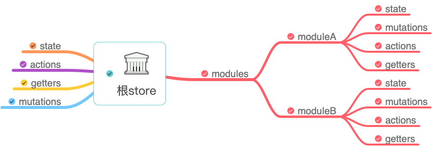

# VUE 项目构建

## 单页应用基本配置

### 外部配置参考 vue.config.js 文件配置

### 内部配置

1\. 路由配置

Vue 这类型的框架都是一个或者多个单页构成，在单页内部进行跳转不会重新渲染 HTML 文件，页面路由由前端进行控制。

使用 vue-router 插件

```js
import Vue from 'vue';
import Router from 'vue-router';
import Home from './views/Home.vue';

Vue.use(Router);

export default new Router({
  mode: 'history',
  base: process.env.BASE_URL,
  routes: [
    {
      path: '/',
      name: 'home',
      component: Home,
    },
    {
      path: '/about',
      name: 'about',
      // route level code-splitting
      // this generates a separate chunk (about.[hash].js) for this route 按需加载；延迟加载；推荐使用下面的形式实现声明。
      // which is lazy-loaded when the route is visited.
      component: () => import(/* webpackChunkName: "about" */ './views/About.vue'),
    },
  ],
});

```

这是 vue-cli 默认生成的路由配置文件，需要注意一下几点

* base属性，默认 “/”
* 默认路由模式是 hash 模式，会携带 # 标记，但是无需特殊服务器配置路径重写，一般推荐使用 history。开发测试时候想本机测试打包后页面，不想部署服务器可以采用 hash 模式测试。
* 页面组件没有进行按需加载，可以使用 `require.ensure()`；require.ensure() 是 webpack 特有的，已经被 import() 取代。

```js
// 按需加载；延迟加载
const Home = () => import('./views/Home.vue');
// 我们创建了一个返回 import() 函数的函数，并不直接导入文件，Webpack 会将动态导入的内容单独放入一个文件中那个，除非调用这个函数，否则 import() 不会被调用。
```

2\. Vuex 配置

Vuex 是专门为 Vue.js 应用程序开发的状态管理模式。

```js
// store.js
import Vue from 'vue';
import Vuex from 'vuex';

Vue.use(Vuex);

export default new Vuex.Store({
  state: {

  },
  mutations: {

  },
  actions: {

  },
});
```

该配置文件便是 Vuex 的配置文件，主要有4个核心点：state、mutations、actions 及 getter;我们可以通过 actions 异步提交 mutations 去修改 state 的值并通过 getter 获取。

注意并不是每个项目都适合 Vuex，一般中大型项目使用 Vuex 来管理复杂的状态数据，而为了后期的拓展性和可维护性，建议拆分 store.js。

```js
└── store
    ├── index.js          # 我们组装模块并导出 store 的地方
    ├── actions.js        # 根级别的 action
    ├── mutations.js      # 根级别的 mutation
    └── modules
        ├── moduleA.js    # A模块
        └── moduleB.js    # B模块
```



与单个 store.js 文件不同，我们按模块进行了划分，每个模块中都可以包含自己的 4 个核心功能。

```js
/* moduleA.js */

const moduleA = {
    state: {
        text: 'hello'
    },
    mutations: {
        addText (state, txt) {
            // 这里的 `state` 对象是模块的局部状态
            state.text += txt
        }
    },
    actions: {
        setText ({ commit }) {
            commit('addText', ' world')
        }
    },

    getters: {
        getText (state) {
            return state.text + '!'
        }
    }
}

export default moduleA

```

上方我们导出 A 模块，并在 index.js 中引入：

```js
/* index.js */

import Vue from 'vue'
import Vuex from 'vuex'
import moduleA from './modules/moduleA'
import moduleB from './modules/moduleB'
import { mutations } from './mutations'
import actions from './actions'

Vue.use(Vuex)

export default new Vuex.Store({
    state: {
        groups: [1]
    },
    modules: {
        moduleA, // 引入 A 模块
        moduleB, // 引入 B 模块
    },
    actions, // 根级别的 action
    mutations, // 根级别的 mutations
    // 根级别的 getters
    getters: {
        getGroups (state) {
            return state.groups
        }
    }
})

```

这样项目中状态的模块划分就更加清晰，对应模块的状态我们只需要修改相应模块文件即可。

3\. 接口配置

默认接口没有默认规定存放地点；一般数据接口我们可以在 src 目录下新建 serveices 文件夹用于存放接口文件。

```js
└── src
    └── services
        ├── http.js      # 接口封装
        ├── moduleA.js    # A模块接口
        └── moduleB.js    # B模块接口

```

简单的接口封装（fetch）

```js
/* http.js */
import 'whatwg-fetch'

// HTTP 工具类
export default class Http {
    static async request(method, url, data) {
        const param = {
            method: method,
            headers: {
                'Content-Type': 'application/json'
            }
        };

        if (method === 'GET') {
            url += this.formatQuery(data)
        } else {
            param['body'] = JSON.stringify(data)
        }

        // Tips.loading(); // 可调用 loading 组件

        return fetch(url, param).then(response => this.isSuccess(response))
            .then(response => {
                return response.json()
            })
    }

    // 判断请求是否成功
    static isSuccess(res) {
        if (res.status >= 200 && res.status < 300) {
            return res
        } else {
            this.requestException(res)
        }
    }

    // 处理异常
    static requestException(res) {
        const error = new Error(res.statusText)

        error.response = res

        throw error
    }

    // url处理
    static formatQuery(query) {
        let params = [];

        if (query) {
            for (let item in query) {
                let vals = query[item];
                if (vals !== undefined) {
                    params.push(item + '=' + query[item])
                }
            }
        }
        return params.length ? '?' + params.join('&') : '';
    }

    // 处理 get 请求
    static get(url, data) {
        return this.request('GET', url, data)
    }

    // 处理 put 请求
    static put(url, data) {
        return this.request('PUT', url, data)
    }

    // 处理 post 请求
    static post(url, data) {
        return this.request('POST', url, data)
    }

    // 处理 patch 请求
    static patch(url, data) {
        return this.request('PATCH', url, data)
    }

    // 处理 delete 请求
    static delete(url, data) {
        return this.request('DELETE', url, data)
    }
}
```

默认接口请求是基于本机地址，如需使用其他地址需要在 vue.config.js 中进行 devServer 配置。

4\. 公共设施配置

项目中运用到的公共方法进行封装，可以在 src 目录下建一个 common 文件夹来存放其配置文件：

```js
└── src
    └── common
        ├── index.js      # 公共配置入口
        ├── validate.js   # 表单验证配置
        └── other.js      # 其他配置
```

在入口文件我们可以向外暴露配置的功能模块，使用时只需引入一个 index.js 文件即可。

## 使用 pages 构建多页应用

对于项目复杂度过高或者页面模块之间差异化较大的项目，我们可以选择构建多页应用来实现。

> 首先我们可以把多页应用理解为由多个单页构成的应用，而何谓多个单页呢？其实你可以把一个单页看成是一个 html 文件，那么多个单页便是多个 html 文件，多页应用便是由多个 html 组成的应用，如下图所示：


既然多页应用拥有多个 html，那么同样其应该拥有多个独立的入口文件、组件、路由、vuex 等。没错，说简单一点就是**多页应用的每个单页都可以拥有单页应用 src 目录下的文件及功能**，我们来看一下一个基础多页应用的目录结构：

```js
├── node_modules               # 项目依赖包目录
├── build                      # 项目 webpack 功能目录
├── config                     # 项目配置项文件夹
├── src                        # 前端资源目录
│   ├── images                 # 图片目录
│   ├── components             # 公共组件目录
│   ├── pages                  # 页面目录
│   │   ├── page1              # page1 目录
│   │   │   ├── components     # page1 组件目录
│   │   │   ├── router         # page1 路由目录
│   │   │   ├── views          # page1 页面目录
│   │   │   ├── page1.html     # page1 html 模板
│   │   │   ├── page1.vue      # page1 vue 配置文件
│   │   │   └── page1.js       # page1 入口文件
│   │   ├── page2              # page2 目录
│   │   └── index              # index 目录
│   ├── common                 # 公共方法目录
│   └── store                  # 状态管理 store 目录
├── .gitignore                 # git 忽略文件
├── .env                       # 全局环境配置文件
├── .env.dev                   # 开发环境配置文件
├── .postcssrc.js              # postcss 配置文件
├── babel.config.js            # babel 配置文件
├── package.json               # 包管理文件
├── vue.config.js              # CLI 配置文件
└── yarn.lock                  # yarn 依赖信息文件

```

根据上方目录结构我们可以看出其实 pages 下的一个目录就是一个单页包含的功能，这里我们包含了 3 个目录就构成了多页应用。

除了目录结构的不同外，其实区别单页应用，多页应用在很多配置上都需要进行修改，比如单入口变为多入口、单模板变为多模板等，那么下面我们就来了解一下多页应用的具体实现。

### 多入口

在单页应用中，我们的入口文件只有一个，CLI 默认配置的是 main.js，但是多页面应用中，我们的入口文件取决于 pages 文件夹下目录的个数，为了项目的可拓展性，我们需要配置到 webpack 中的 entry 属性上，如：

```js
// vue.config.js
module.exports = {
    ...
    entry: {
        page1: '/xxx/pages/page1/page1.js',
        page2: '/xxx/pages/page2/page2.js',
        index: '/xxx/pages/index/index.js',
    },
    ...
}

```

设置自动配置入口路径

读取并解析路径，我们可以在根目录新建 build 文件夹存放 utils.js 这样共用的 webpack 功能性文件，并加入多入口读取解析方法：

```js
// utils.js
const path = require('path');

// glob 是 webpack 安装时依赖的一个第三方模块，该模块允许你使用 * 等符号,
// 例如 lib/*.js 就是获取 lib 文件夹下的所有 js 后缀名的文件
const glob = require('glob');

// 取得相应的页面路径，因为之前的配置，所以是 src 文件夹下的 pages 文件夹
const PAGE_PATH = path.resolve(__dirname, '../src/pages');

/*
* 多入口配置
* 通过 glob 模块读取 pages 文件夹下的所有对应文件夹下的 js * 后缀文件，如果该文件存在
* 那么就作为入口处理
*/
exports.getEntries = () => {
    let entryFiles = glob.sync(PAGE_PATH + '/*/*.js') // 同步读取所有入口文件
    let map = {}

    // 遍历所有入口文件
    entryFiles.forEach(filePath => {
        // 获取文件名
        let filename = filePath.substring(filePath.lastIndexOf('\/') + 1, filePath.lastIndexOf('.'))

        // 以键值对的形式存储
        map[filename] = filePath
    })

    return map
}
```


上方我们使用了 [glob](https://github.com/isaacs/node-glob) 这一第三方模块读取所有 pages 文件夹下的入口文件，其需要进行安装：`yarn add glob --dev`

读取并存储完毕后，我们得到一个入口文件的对象集合，这个对象我们便可以将其设置到 webpack 的 entry 属性上，这里我们需要修改 vue.config.js 的配置来间接修改 webpack 的值：

```js
// vue.config.js
const utils = require('./build/utils')

module.exports = {
    ...

    configureWebpack: config => {
        config.entry = utils.getEntries()
    },

    ...
}

```

### 多模版

相对于多入口来说，多模版的配置也是大同小异，这里说的模版便是每个 page 下的 html 模版文件，而模版文件的作用主要用于 webpack 中 `html-webpack-plugin` 插件的配置，其会根据模版文件生产一个编译后的 html 文件并自动加入携带 hash 的脚本和样式

```js
// webpack 配置文件
const HtmlWebpackPlugin = require('html-webpack-plugin') // 安装并引用插件

module.exports = {
    ...

    plugins: [
        new HtmlWebpackPlugin({
            title: 'My Page', // 生成 html 中的 title
            filename: 'demo.html', // 生成 html 的文件名
            template: 'xxx/xxx/demo.html', // 模板路径
            chunks: ['manifest', 'vendor', 'demo'], // 所要包含的模块
            inject: true, // 是否注入资源
        })
    ]

    ...
}
```

以上是单模版的配置，如果是多模版只要继续添加 HtmlWebpackPlugin 即可，但是为了和多入口一样能灵活的获取 pages 目录下的模版并进行配置，我们可以在 utils.js 中添加多模版的读取解析方法：

```js
// utils.js
// 多页面输出配置
// 与上面的多页面入口配置相同，读取 page 文件夹下的对应的 html 后缀文件，然后放入数组中
exports.htmlPlugin = configs => {
    let entryHtml = glob.sync(PAGE_PATH + '/*/*.html')
    let arr = []

    entryHtml.forEach(filePath => {
        let filename = filePath.substring(filePath.lastIndexOf('\/') + 1, filePath.lastIndexOf('.'))
        let conf = {
            template: filePath, // 模板路径
            filename: filename + '.html', // 生成 html 的文件名
            chunks: ['manifest', 'vendor',  filename],
            inject: true,
        }

        // 如果有自定义配置可以进行 merge
        if (configs) {
            conf = merge(conf, configs)
        }

        // 针对生产环境配置
        if (process.env.NODE_ENV === 'production') {
            conf = merge(conf, {
                minify: {
                    removeComments: true, // 删除 html 中的注释代码
                    collapseWhitespace: true, // 删除 html 中的空白符
                    // removeAttributeQuotes: true // 删除 html 元素中属性的引号
                },
                chunksSortMode: 'manual' // 按 manual 的顺序引入
            })
        }

        arr.push(new HtmlWebpackPlugin(conf))
    })

    return arr
}
```


以上我们仍然是使用 glob 读取所有模板文件，然后将其遍历并设置每个模板的 config，同时针对一些自定义配置和生产环境的配置进行了 merge 处理，其中自定义配置的功能我会在下节进行介绍，这里介绍一下生产环境下 `minify` 配置的作用：**将 html-minifier 的选项作为对象来缩小输出**。

[html-minifier](https://github.com/kangax/html-minifier) 是一款用于缩小 html 文件大小的工具，其有很多配置项功能，包括上述所列举的常用的删除注释、空白、引号等。

当我们编写完了多模板的方法后，我们同样可以在 vue.config.js 中进行配置，与多入口不同的是我们在 configureWebpack 中不能直接替换 plugins 的值，因为它还包含了其他插件，这时候大家还记得第 3 节中讲到的使用 return 返回一个对象来进行 merge 操作吗？

```js
/* vue.config.js */

const utils = require('./build/utils')

module.exports = {
    ...

    configureWebpack: config => {
        config.entry = utils.getEntries() // 直接覆盖 entry 配置

        // 使用 return 一个对象会通过 webpack-merge 进行合并，plugins 不会置空
        return {
            plugins: [...utils.htmlPlugin()]
        }
    },

    ...
}

```

### 使用 pages 配置(官方默认方法)

```js
// vue.config.js
module.exports = {
  pages: {
    index: {
      // page 的入口
      entry: 'src/index/main.js',
      // 模板来源
      template: 'public/index.html',
      // 在 dist/index.html 的输出
      filename: 'index.html',
      // 当使用 title 选项时，
      // template 中的 title 标签需要是 <title><%= htmlWebpackPlugin.options.title %></title>
      title: 'Index Page',
      // 在这个页面中包含的块，默认情况下会包含
      // 提取出来的通用 chunk 和 vendor chunk。
      chunks: ['chunk-vendors', 'chunk-common', 'index']
    },
    // 当使用只有入口的字符串格式时，
    // 模板会被推导为 `public/subpage.html`
    // 并且如果找不到的话，就回退到 `public/index.html`。
    // 输出文件名会被推导为 `subpage.html`。
    subpage: 'src/subpage/main.js'
  }
}
```

pages 对象中的 key 就是入口的别名，而其 value 对象其实是入口 entry 和模板属性的合并，这样我们上述介绍的获取多入口和多模板的方法就可以合并成一个函数来进行多页的处理，合并后的 setPages 方法如下：

```js
//utils.js
exports.setPages = configs => {
    let entryFiles = glob.sync(PAGE_PATH + '/*/*.js')
    let map = {}

    entryFiles.forEach(filePath => {
        let filename = filePath.substring(filePath.lastIndexOf('\/') + 1, filePath.lastIndexOf('.'))
        let tmp = filePath.substring(0, filePath.lastIndexOf('\/'))

        let conf = {
            // page 的入口
            entry: filePath, 
            // 模板来源
            template: tmp + '.html', 
            // 在 dist/index.html 的输出
            filename: filename + '.html', 
            // 页面模板需要加对应的js脚本，如果不加这行则每个页面都会引入所有的js脚本
            chunks: ['manifest', 'vendor', filename], 
            inject: true,
        };

        if (configs) {
            conf = merge(conf, configs)
        }

        if (process.env.NODE_ENV === 'production') {
            conf = merge(conf, {
                minify: {
                    removeComments: true, // 删除 html 中的注释代码
                    collapseWhitespace: true, // 删除 html 中的空白符
                    // removeAttributeQuotes: true // 删除 html 元素中属性的引号
                },
                chunksSortMode: 'manual'// 按 manual 的顺序引入
            })
        }

        map[filename] = conf
    })

    return map
}
```

上述代码我们 return 出的 map 对象就是 pages 所需要的配置项结构，我们只需在 vue.config.js 中引用即可：

```js
/* vue.config.js */

const utils = require('./build/utils')

module.exports = {
    ...

    pages: utils.setPages(),

    ...
}

```

## 多页路由与模版解析

### 路由设置

#### 跳转

多页应用中每个单页面都是相互隔离的，即从一个单页跳转到另一个单页是无法使用 vue-router，需要使用原生方法 `location.href` or `location.replace`。

为了能够清晰的分辨路由属于哪个单页面下，我们一般如下定义：

* index 单页：/vue/
* page1 单页：/vue/page1/
* page2 单页：/vue/page2/

/vue/ 为项目的二级目录，后面的目录代表属于哪个单页。

```js
// router.js
import Vue from 'vue'
import Router from 'vue-router'

// 首页
// const Home = (resolve => {
//     require.ensure(['../views/home.vue'], () => {
//         resolve(require('../views/home.vue'))
//     })
// })

const Home = () => import('../views/home.vue');

Vue.use(Router)

let base = `${process.env.BASE_URL}` + 'page1'; // 添加单页前缀

export default new Router({
    mode: 'history',
    base: base,
    routes: [
        {
            path: '/',
            name: 'home',
            component: Home
        },
    ]
})
```

我们通过设置路由的 base 值来为每个单页添加路由前缀，如果是 index 单页我们无需拼接路由前缀，直接跳转至二级目录即可。

那么在单页间跳转的地方，我们可以这样写：

```html
<template>
  <div id="app">
    <div id="nav">
      <a @click="goFn('')">Index</a> |
      <a @click="goFn('page1')">Page1</a> |
      <a @click="goFn('page2')">Page2</a> |
    </div>
    <router-view/>
  </div>
</template>

<script>
export default {
    methods: {
        goFn(name) {
            location.href = `${process.env.BASE_URL}` + name
        }
    }
}
</script>

```

> 页面间的跳转必定会引发页面重载

#### 重定向

多页面间的跳转还需要服务器进行一次重定向，要不浏览器默认还是位于 Index 根路由下

```js
/vue/page1 -> /vue/page1.html
/vue/page2 -> /vue/page2.html
```

在 vue.config.js 中，我们需要对 devServer 进行配置，添加 `historyApiFallback` 配置项，该配置项主要用于解决 HTML5 History API 产生的问题，比如其 rewrites 选项用于重写路由：

```js
/* vue.config.js */

let baseUrl = '/vue/';

module.exports = {
    ...

    devServer: {
        historyApiFallback: {
            rewrites: [
                { from: new RegExp(baseUrl + 'page1'), to: baseUrl + 'page1.html' },
                { from: new RegExp(baseUrl + 'page2'), to: baseUrl + 'page2.html' },
            ]
        }
    }

    ...
}

```

上方我们通过 rewrites 匹配正则表达式的方式将 `/vue/page1` 这样的路由替换为访问服务器下正确 html 文件的形式，如此不同单页间便可以进行正确跳转和访问了。最后需要注意的是如果你的应用发布到正式服务器上，你同样需要让服务器或者中间层作出合理解析，参考：[HTML5 History 模式 # 后端配置例子](https://router.vuejs.org/zh/guide/essentials/history-mode.html#%E5%90%8E%E7%AB%AF%E9%85%8D%E7%BD%AE%E4%BE%8B%E5%AD%90)

而更多关于 historyApiFallback 的信息可以访问：[connect-history-api-fallback](https://github.com/bripkens/connect-history-api-fallback)

### 模板配置

#### 模板渲染

这里所说的模板渲染是在我们的 html 模板文件中使用 html-webpack-plugin 提供的 [default template](https://github.com/jaketrent/html-webpack-template/blob/86f285d5c790a6c15263f5cc50fd666d51f974fd/index.html) 语法进行模板编写，比如：

```html
<!DOCTYPE html>
<html>
  <head>
    <meta charset="utf-8">
    <meta http-equiv="X-UA-Compatible" content="IE=edge">
    <meta name="viewport" content="width=device-width,initial-scale=1.0">
    <title>模板</title>
    <% for (var chunk in htmlWebpackPlugin.files.css) { %>
        <% if(htmlWebpackPlugin.files.css[chunk]) {%>
            <link href="<%= htmlWebpackPlugin.files.css[chunk] %>" rel="stylesheet" />
        <%}%>
    <% } %>
  </head>
  <body>
    <div id="app"></div>
    <!-- built files will be auto injected -->

    <% for (var chunk in htmlWebpackPlugin.files.js) { %>
        <% if(htmlWebpackPlugin.files.js[chunk]) {%>
            <script type="text/javascript" src="<%= htmlWebpackPlugin.files.js[chunk] %>"></script>
        <%}%>
    <% } %>
  </body>
</html>

```

以上我们使用模板语法手动获取并遍历 htmlWebpackPlugin 打包后的文件并生成到模板中，其中的 `htmlWebpackPlugin` 变量是模板提供的可访问变量，其有以下特定数据：

```js
"htmlWebpackPlugin": {
    "files": {
        "css": [ "main.css" ],
        "js": [ "assets/head_bundle.js", "assets/main_bundle.js"],
        "chunks": {
            "head": {
                "entry": "assets/head_bundle.js",
                "css": [ "main.css" ]
            },
            "main": {
                "entry": "assets/main_bundle.js",
                "css": []
            },
        }
    }
}

```

我们通过 `htmlWebpackPlugin.files` 可以获取打包输出的 js 及 css 文件路径，包括入口文件路径等。

需要注意的是如果你在模板中编写了插入对应 js 及 css 的语法，你需要设置 `inject` 的值为 false 来关闭资源的自动注入：

```js
/* utils.js */
...

let conf = {
    entry: filePath, // page 的入口
    template: filePath, // 模板路径
    filename: filename + '.html', // 生成 html 的文件名
    chunks: ['manifest', 'vendor',  filename],
    inject: false, // 关闭资源自动注入
}

...

```

否则在页面会引入两次资源，如下图所示：


#### 自定义配置

在模板渲染中，我们只能够使用 htmlWebpackPlugin 内部的一些属性和方法来进行模板的定制化开发，那么如果遇到需要根据不同环境来引入不同资源，同时不同模板间的配置还可能不一样的需求情况的话，我们使用自定义配置会比较方便。比如我们需要在生产环境模板中引入第三方统计脚本：

```js
/* vue.config.js */

module.exports = {
    ...

    pages: utils.setPages({
        addScript() {
            if (process.env.NODE_ENV === 'production') {
                return `
                    <script src="https://s95.cnzz.com/z_stat.php?id=xxx&web_id=xxx" language="JavaScript"></script>
                `
            }
            return ''
        }
    }),
    ...
}
```

然后在页面模板中通过 `htmlWebpackPlugin.options` 获取自定义配置对象并进行输出：

```html
<% if(htmlWebpackPlugin.options.addScript){ %>
    <%= htmlWebpackPlugin.options.addScript() %>
<%}%>

```

同时你也可以针对个别模板进行配置，比如我想只在 Index 单页中添加统计脚本，在 Page1 单页中添加其他脚本，那么你可以给 addScript 传入标识符来进行判断输出，比如：

```html
<% if(htmlWebpackPlugin.options.addScript){ %>
    <%= htmlWebpackPlugin.options.addScript('index') %>
<%}%>

```

同时为 addScript 方法添加参数 from：

```js
addScript(from) {
    if (process.env.NODE_ENV === 'production') {
        let url = "https://xxx";

        if (from === 'index') {
            url = "https://s95.cnzz.com/z_stat.php?id=xxx&web_id=xxx";
        }

        return `
            <script src=${url} language="JavaScript"></script>
        `
    }

    return ''
}

```

这样我们就完成了自定义配置中的模板渲染功能。当然根据实际项目需求你的自定义配置项可能会更加复杂和灵活。

## 项目优化

### 使用 alias 简化路径

在不使用 `alias` 时路径引入

```js
import HelloWorld from '../../../HelloWorld.vue'
```

在 CLI 3.X 中我们通过 chainWebpack 进行配置 alias

```js
// vue.config.js
module.exports = {
    ...

    chainWebpack: config => {
        config.resolve.alias
            .set('@', resolve('src'))
            .set('_lib', resolve('src/common'))
            .set('_com', resolve('src/components'))
            .set('_img', resolve('src/images'))
            .set('_ser', resolve('src/services'))
    },

    ...
}
```

这样我们修改 webpack alias 来简化路径的优化就实现了。但是需要注意的是对于在样式及 html 模板中引用路径的简写时，前面需要加上 `～` 符，否则路径解析会失败，如：

```js
.img {
    background: (~_img/home.png);
}

```

### 整合功能模块

在多页应用的构建中，由于存在多个入口文件，因此会出现重复书写相同入口配置的情况，这样对于后期的修改和维护都不是特别友好，需要修改所有入口文件的相同配置，比如在 index 单页的入口中我们引用了 VConsole 及 performance 的配置，同时在 Vue 实例上还添加了 $openRouter 方法：

```js
import Vue from 'vue'
import App from './index.vue'
import router from './router'
import store from '@/store/'
import { Navigator } from '../../common'

// 如果是非线上环境，不加载 VConsole
if (process.env.NODE_ENV !== 'production') {
    var VConsole = require('vconsole/dist/vconsole.min.js');
    var vConsole = new VConsole();

    Vue.config.performance = true;
}

Vue.$openRouter = Vue.prototype.$openRouter = Navigator.openRouter;

new Vue({
  router,
  store,
  render: h => h(App)
}).$mount('#app')

```

而在 page1 和 page2 的入口文件中也同样进行了上述配置，那我们该如何整合这些重复代码，使其能够实现一次修改多处生效的功能呢？最简单的方法便是封装成一个共用方法来进行调用，这里我们可以在 common 文件夹下新建 entryConfig 文件夹用于放置入口文件中公共配置的封装，封装代码如下：

```js
import { Navigator } from '../index'

export default (Vue) => {

    // 如果是非线上环境，不加载 VConsole
    if (process.env.NODE_ENV !== 'production') {
        var VConsole = require('vconsole/dist/vconsole.min.js');
        var vConsole = new VConsole();

        Vue.config.performance = true;
    }

    Vue.$openRouter = Vue.prototype.$openRouter = Navigator.openRouter;
}

```

上述代码我们向外暴露了一个函数，在调用它的入口文件中传入 Vue 实例作为参数即可实现内部功能的共用，我们可以将原本的入口文件简化为:

```js
import Vue from 'vue'
import App from './index.vue'
import router from './router'
import store from '@/store/'
import entryConfig from '_lib/entryConfig/'

// 调用公共方法加载配置
entryConfig(Vue)

new Vue({
  router,
  store,
  render: h => h(App)
}).$mount('#app')

```

这样我们便完成了入口文件配置的整合，当然你还可以给该函数传入 router 实例及自定义参数用于其他共用配置的封装。

### 开启 Gzip 压缩

我们介绍了 CLI 为我们内置的 webpack plugins，使用这些内置插件基本已经能够满足我们大多数项目的构建和优化，当然你仍然可以为项目添加自己想要的插件来实现一些差异化的功能，比如使用 [compression-webpack-plugin](https://www.npmjs.com/package/compression-webpack-plugin) 来开启 Gzip 压缩。在 vue.config.js 配置文件中，我们通过 configureWebpack 中返回一个对象来实现 plugins 的合并：

```js
/* vue.config.js */
const isPro = process.env.NODE_ENV === 'production'

module.exports = {
    ...

    configureWebpack: config => {
        if (isPro) {
            return {
                plugins: [
                    new CompressionWebpackPlugin({
                         // 目标文件名称。[path] 被替换为原始文件的路径和 [query] 查询
                        asset: '[path].gz[query]',
                        // 使用 gzip 压缩
                        algorithm: 'gzip',
                        // 处理与此正则相匹配的所有文件
                        test: new RegExp(
                            '\\.(js|css)$'
                        ),
                        // 只处理大于此大小的文件
                        threshold: 10240,
                        // 最小压缩比达到 0.8 时才会被压缩
                        minRatio: 0.8，
                    })
                ]
            }
        }
    }
    ...
}

```

但是需要注意的是访问 Gzip 压缩的文件需要服务端进行相应配置，以下是 Nginx Gzip 压缩的流程：

> Nginx 开启 Gzip 压缩配置后，其会根据配置情况对指定的类型文件进行压缩，主要针对 JS 与 CSS 。如果文件路径中存在与原文件同名（加了个 .gz），Nginx 会获取 gz 文件，如果找不到，会主动进行 Gzip 压缩。

这里我们推荐使用 [webpack-bundle-analyzer](https://www.npmjs.com/package/webpack-bundle-analyzer) 这一款 webpack 插件来进行包文件的分析，下面我们就来介绍下其配置和使用方法。
